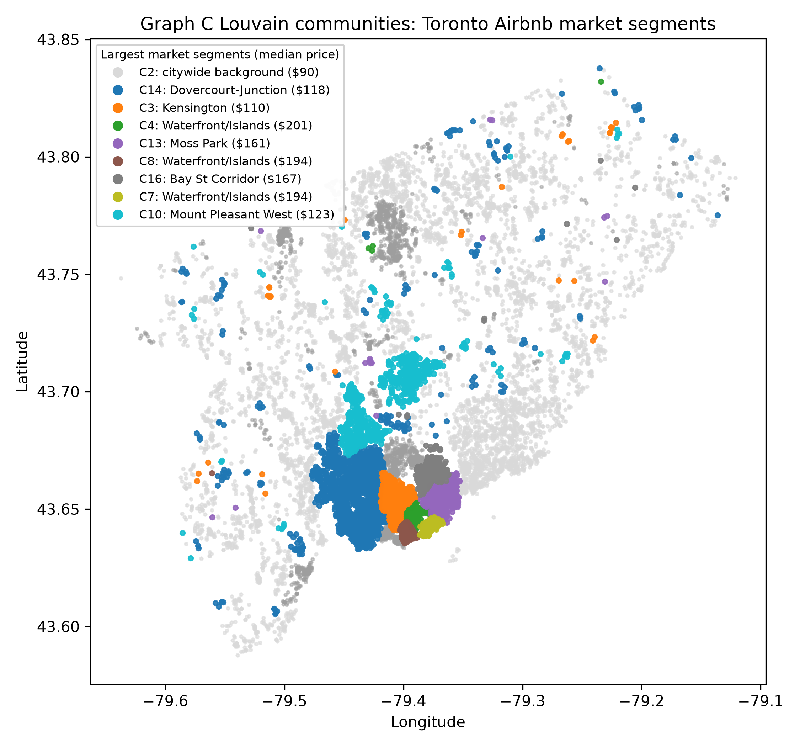
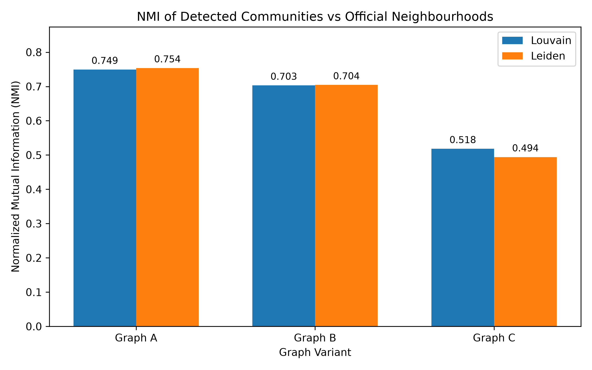

# Toronto Airbnb Market Network Analysis

[](https://github.com/souravC01/toronto-airbnb-market-network/actions/workflows/ci.yml)

How closely do Airbnb market segments follow Toronto's official neighbourhood boundaries?

This project models 15,809 Toronto Airbnb listings as a weighted information network. It combines geographic proximity, shared-host ownership, and listing similarity; detects communities with Louvain and Leiden; and tests whether those communities add information to a conventional price model.



## Interactive portfolio

The findings are also presented as an interactive, responsive case study with graph-layer, community-algorithm, validation-scheme, and parameter-sensitivity explorers.

[Open the live interactive case study](https://toronto-airbnb-market-network.vercel.app/).

[Open the original EECS 4414 final report](portfolio/public/report/EECS4414-Airbnb-Network-Analysis-Final-Report.pdf). The PDF is preserved unchanged with its original submission authorship.

To run the presentation locally:

```bash
cd portfolio
pnpm install
pnpm run dev
```

## Why this project matters

Official neighbourhoods are administrative units, but rental markets can cross those boundaries. A network representation makes it possible to identify groups of listings connected by location, ownership, and product characteristics rather than assuming the city's map already defines the market.

The project investigates three questions:

1. How do spatial, host, and attribute relationships change network structure?
2. Do detected communities reproduce official neighbourhoods or reveal broader market segments?
3. Does community membership improve out-of-sample price prediction?

## Approach

| Variant | Relationships included | Purpose |
|---|---|---|
| Graph A | Spatial proximity within 500 metres | Geographic baseline |
| Graph B | Spatial proximity + shared host | Adds ownership structure |
| Graph C | Spatial + shared host + attribute similarity | Full market network |

Each graph is evaluated with:

- Network size, density, connectivity, degree, and sampled weighted clustering
- Louvain and Leiden community detection and modularity
- Normalized Mutual Information (NMI) and Variation of Information (VI) against official neighbourhoods
- A ridge-regression comparison with and without Graph C community membership
- Five-fold random, host-grouped, and spatial-block validation of the paired price models
- A seven-configuration, one-at-a-time sensitivity analysis around the Graph C design

Price is not used to construct graph edges.

## Main findings

- Adding host and listing-similarity edges progressively connects otherwise separate geographic clusters. Graph C forms one connected component.
- Spatial-only communities align most closely with official neighbourhoods. Graph C communities span broader parts of the city, consistent with market segments that do not follow administrative boundaries.
- Louvain and Leiden produce similar modularity values, although their community assignments are not identical.
- The broad Graph C structure survives reasonable parameter changes, but exact membership is parameter-dependent: alternatives produce 14–21 communities and NMI of 0.69–0.86 against the baseline partition.
- Across random, host-grouped, and spatial five-fold validation, community membership increases mean raw R² by only 0.0016–0.0024. Mean adjusted R² declines in every scheme, so the project does not claim a material price-prediction gain.

| Validation scheme | Baseline R² | With community | Mean ΔR² | Mean Δ adjusted R² |
|---|---:|---:|---:|---:|
| Random 5-fold | 0.6341 | 0.6358 | +0.0017 | -0.0004 |
| Host-grouped 5-fold | 0.6246 | 0.6262 | +0.0016 | -0.0007 |
| Spatial-block 5-fold | 0.5290 | 0.5314 | +0.0024 | -0.0010 |

The validation is transductive: communities are learned once from the full price-free graph before the price folds are created. It tests robustness across held-out listings, hosts, and areas, but it is not a deployment simulation for completely unseen listings. See [`docs/ROBUSTNESS.md`](docs/ROBUSTNESS.md) for the design and interpretation.



## Reproduce the project

Python 3.12 or newer is recommended.

```bash
python -m venv .venv
```

Activate the environment, then install the exact verified dependency set:

```bash
python -m pip install -r requirements-lock.txt
```

Run the complete pipeline from the repository root:

```bash
python scripts/run_pipeline.py
```

The pipeline rebuilds all graph variants, runs Louvain and Leiden, evaluates the price models, runs the robustness suite, regenerates the portfolio figures, and validates the resulting artifacts. It constructs graphs with up to about 2.6 million edges in the sensitivity sweep and completed in approximately nine and a half minutes on the verification machine. Weighted clustering is estimated from a fixed 500-node sample because the exact NetworkX calculation is prohibitively slow at this scale.

To run only the core experiment:

```bash
python src/airbnb_final_experiments.py --run-leiden
```

## Verify the repository

Run the fast unit tests:

```bash
python -m unittest discover -s tests -v
```

Validate the committed tables, figures, and portfolio assets:

```bash
python scripts/validate_repository.py
```

GitHub Actions runs both checks for every push and pull request.

## Repository structure

```text
.
├── .github/workflows/ci.yml       # automated checks
├── data/                          # cleaned Toronto snapshot and provenance
├── docs/                          # script-level documentation
├── portfolio/                     # interactive portfolio case study
├── render.yaml                    # temporary legacy Render fallback
├── results/
│   ├── figures/                   # generated publication figures
│   └── tables/                    # canonical experiment results
├── scripts/
│   ├── run_pipeline.py            # one-command reproducible pipeline
│   └── validate_repository.py     # artifact consistency checks
├── src/
│   ├── robustness_analysis.py     # grouped/spatial CV and sensitivity suite
│   └── ...                        # cleaning, experiments, and visualization code
├── tests/                         # fast unit tests
├── requirements.txt              # supported dependency ranges
└── requirements-lock.txt         # exact verified environment
```

## Data

The included cleaned dataset was derived from the November 2025 Toronto snapshot published by [Inside Airbnb](https://insideairbnb.com/get-the-data/). It contains the public listing-level fields used by this analysis. See [`data/README.md`](data/README.md) for provenance, transformations, and redistribution considerations.

## Portfolio ownership

This repository is Sourav Chandhok's independently maintained portfolio edition of a York University EECS 4414 research project. It contains the reproducibility improvements, robustness experiments, canonical outputs, and interactive presentation maintained for portfolio use. The original final report is included unchanged as a historical course artifact with its original submission authorship intact.

## Current limitations

- Exact community membership changes with distance, neighbour-count, and edge-weight choices even though the broad full-graph pattern persists.
- Price validation is transductive because the full price-free graph is built before the folds; assigning entirely unseen listings remains future work.
- The cleaned dataset is a single temporal snapshot and cannot measure changes over time.
- A standalone software license has not yet been selected.
